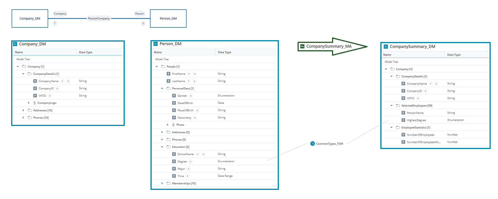
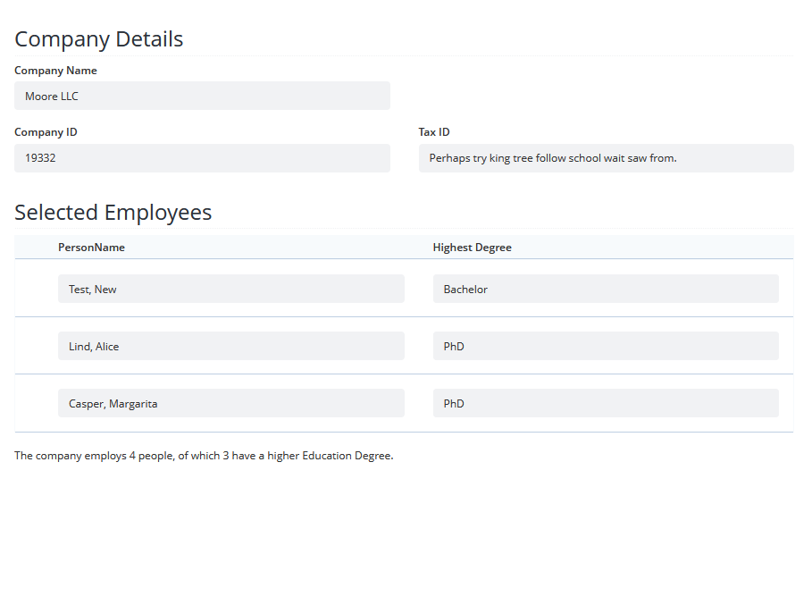
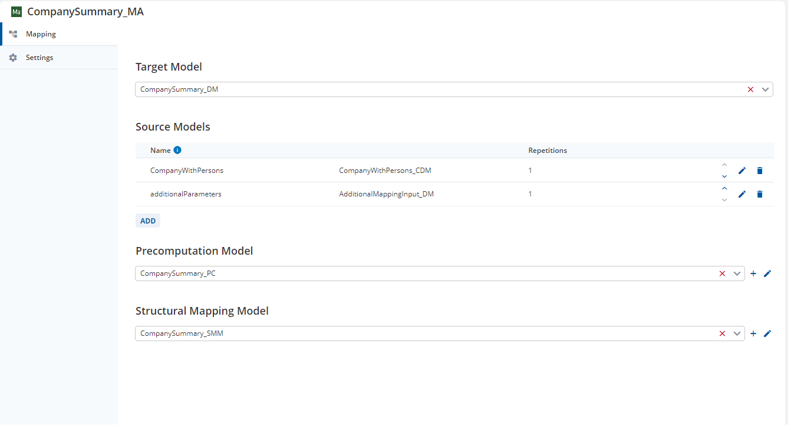
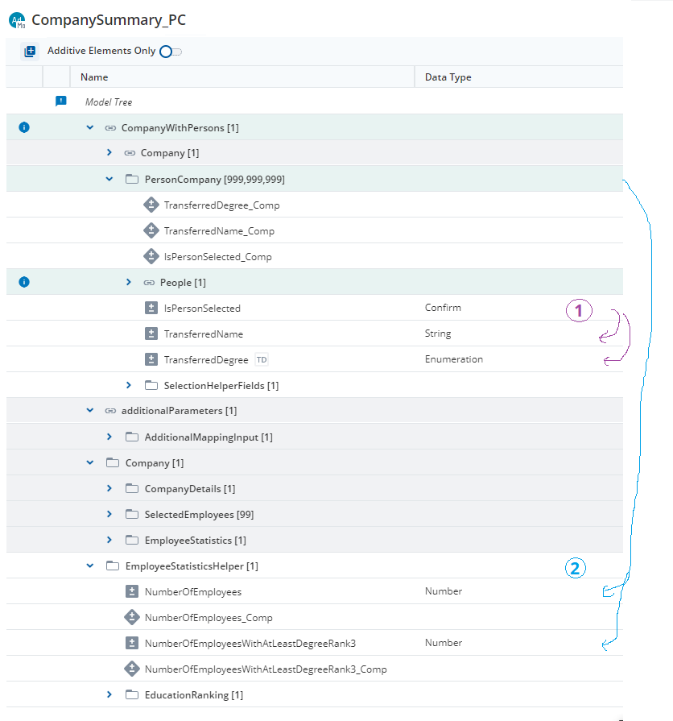
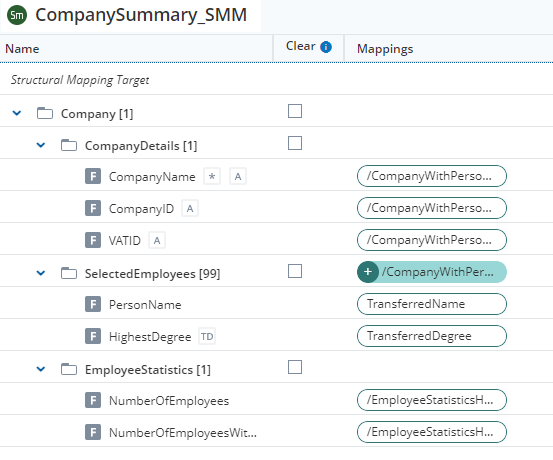
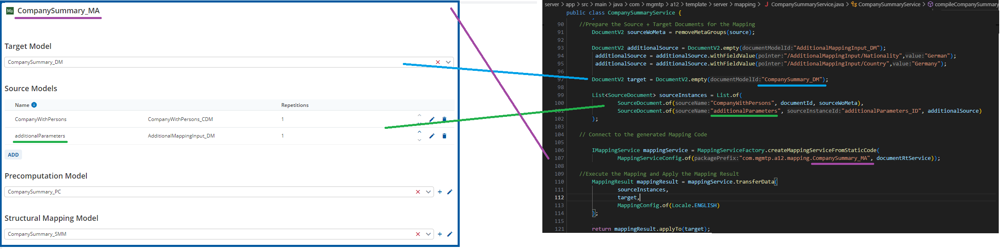
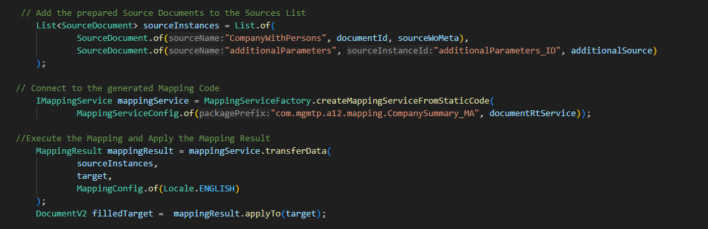

<picture>
  <source media="(prefers-color-scheme: dark)" srcset="https://www.mgm-tp.com/global-content/cd/logos/a12/app-icons/dark/A12-Dark.svg" />
  
</picture>

# Project Template

Use this template to quickstart your A12-based project. For more information about the Project Template and how to get started, check out the detailed documentation on [GetA12].

---

## License

Parts of the A12 platform are made available under a **dual license**.  
Please check the [LICENSE](./LICENSE) file for details.

---

## Getting Started

### How to Build and Run

#### Prerequisites (tools and their versions)

Proper environment setup is crucial for the successful build and run of this project. Please follow the steps in the [environment and tools setup] documentation carefully.

To wrap up, the following [tools](./tool-versions.json) are required to build this project. Versions are maintained in `./tool-versions.json` file and follow [npm semver] versioning patterns.

<!--- VERSION_TABLE_START (Edit versions in tool-versions.json, not here. Do not delete this tag.) --->
| Tool                 | Version     | Note |
|----------------------|-------------|------|
| [JDK]                | '>=21 <=25' |      |
| [Gradle]1 | '>=9.0.x'   |      |
| [Node]               | '24.x.x'    |      |
| [npm]1    | '>=11.x.x'  |      |
| [Docker]1 | '>=20.x'    |      |
| [Docker Compose]     | '>=2.20.3'  |      |
<!--- VERSION_TABLE_END (Edit versions in tool-versions.json, not here. Do not delete this tag.) --->

1) These tools have to be configured to use proper Artifactory. Please, follow [Artifactory access] documentation to set it up.

#### How to Build

To build the application modules:

`gradle build`

#### How to Test

Please see [e2e/README.md](./e2e/README.md) for guidelines on how to test the Project Template.

#### How to Run

Assuming you went through the documentation, your environment is set up, project is prepared and the build was successful, you need to do the following to run the application:

1. Project Template application
    1. Compose up the Keycloak container in Docker:
        `gradle keycloakComposeUp`
        > **WARNING**: Project Template's Keycloak setup is for development purposes only. It is necessary to significantly enhance the security of a Keycloak instance for production environments.
    2. Run the server application with the default development Spring profile and keep it running:  
        `gradle :server:app:bootRun --args='--spring.profiles.active=dev-env'`
    3. Run client:
        1. In another terminal window, move to client directory with `cd client`.
        2. Then start the webpack with `npm start` and keep it running.

2. Project Template init application (for initialization and migration purposes)
    > **WARNING**: Before running the init application, make sure to stop the server application first. The init application will lock the Postgres database during initialization, and the database could become inconsistent if data is being initialized while the server is still running.
    - Run the init application with the default development Spring profile:  
        `gradle :server:init:bootRun --args='--spring.profiles.active=dev-env'`
    - Run the init application with the 'init-data' Spring profile additionally to initialize documents based on the `import/data/request` folder:
        `gradle :server:init:bootRun --args='--spring.profiles.active=dev-env,init-data'`  

#### How to Access It

By default, template services are exposed on the following ports:

| Service                 | Port      | Note        |
|-------------------------|-----------|-------------|
| Frontend                | ``:8081`` |             |
| Project Template Server | ``:8082`` |             |
| Postgres                | ``:8083`` | Docker only |
| Keycloak                | ``:8089`` | Docker only |

Once all services are running, you can access the frontend at [http://localhost:8081](http://localhost:8081).

There are three test users with credentials:

- `admin` / `A12PT-admintest` for Admin role
- `user1` / `A12PT-user1test` for User role
- `user2` / `A12PT-user2test` for User role

Log in with one of these credentials and take a look over the content.
> **WARNING**: Project Template's login setup is for development purposes only. It is necessary to significantly enhance the security of logins and user management for production environments.

---

### Documentation

You can find the details on all topics in the [Geta12] Project Template documentation with links to the direct access below:

- **[Downloads]** - List of the Project Template artifacts downloadable in different variants.
- **[Environment and Tools Setup]** - Details on setting up Gradle, Node & npm, Docker and Java tools, setting their access to the specific Artifactory and some troubleshooting tips.
- **[Getting Started With the Project]** - Description of the structure of the Project Template content, how to get it and what the most important commands for using it are.
- **[File Naming Convention]** - Guidelines for naming files consistently across the project.
- **[Preparation of the Project Template for a New Project]** - Helps with version control initialization of the project, hints on renaming placeholders and changes inside the project needed for external partners.
- **[Build]** - Detailed steps and variants of building the project modules and related Docker images.
- **[Run]** - Possibilities of running and accessing the application as standalone or in Docker containers.
- **[Development Tips]** - Tips on tools, changes and things to focus on, if you are starting with development, for both frontend and backend.
- **[Connecting to Databases]** - Tips on how to connect to databases.
- **[CI/CD]** - Briefly describes the continuous integration and deployment possibilities.
- **[Security]** - Tips for security enhancements of the Project Template.
- **[Enhancement Possibilities]** - Examples of adding your own models and modules.
- **[Working With the SME]** - Describes tools used for modeling and testing of the Project Template.
- **[Data Migration Support]** - Example of a document migration task.
- **[Document Ownership]** - Description of rules and permissions associated with document modification.
- **[End-to-End Testing]** - Description of End-to-End Test setup, how to test your application using Playwright.
- **[Configuration]** - Detailed description of the configuration profiles and other configuration-related files used in the Project Template.
- **[Localization]** - Describes the localization setup and how to adjust it.
- **[Variants]** - Describes variants of the Project Template integrated with A12 products other than Client and Data Services.

- The website also provides access to the **A12 Discourse Community Forum**.

---

## Mapping Example Implementation

In this version of the Project Template, a Mapping example is implemented.
It serves as an example implementation for the usage of the Mapping Code.

**1. Use Case**

We have a Customer Relations Management System, where we collect companies (`Company_DM`) and their employees (`Person_DM`).
They are linked by a Relationship (`PersonCompany`). Each person can be linked to one company.

Not all users of the application are allowed to see all the data, for them we want to prepare a Company Summary page.
It shall look like this example:

It shows
- the basic data of the Company (Name, IDs)
- how many employees the company has in total (text on the bottom)
- how many of them have a higher Education (based on the data given in the `Person_DM`), ranking is done on the Enumeration Category 'Rank'
- of all the employees a list of the 3 with the highest Education Degree (by Enumeration Category 'Rank') who have an address in a selected country or are of a given nationality (based on the data given in `Person_DM` in `/People/Addresses*/Country` and `/People/PersonalData/Nationality`)

The company summary is prepared on server side, the user cannot access more data than is provided in `CompanySummary`.
(Using F12 does not help here. Advantage against a CDM, where the complete data is transferred to the Client.)

**2. Modeling**

We start with the Basic Workspace as shipped with the A12-Installer.

Based on the Use Case above, we model a Document and a Form Model for the Company Summary.
We also create an Overview Model, but this is based on `Company_DM`, so it lists all the Companies in the database, no data selection is done here.

All models related to this use case are placed in the `CompanySummary` folder under `import/models`.

We use the A12 built-in feature Composed Document Models (CDM), to retrieve a company with all their linked persons in one go from Data Services.
Alternatively, one could obtain the companies and their linked employees separately and feed them into the Mapper as different Sources.

By using a CDM, we only have one Source, with only one Document.
This CDM (`CompanyWithPersons_CDM`) is modeled in the SME by adding a CDM to the workspace and selecting `Company_DM` as Root Model.
Clicking on the Relationship `PersonCompany` in the CDM Editor's Element Picker adds the Relationship and Document Model elements to the CDM.
We do not need a Form Model for it, since we only use it in the backend.

In order to feed additional information (selected country and nationality) **in the backend** into the mapping process, we create one more Document Model
`AdditionalMappingInput_DM`, that just contains two Fields (`Nationality`, `Country`) to hold the respective information.
At runtime, the server creates a document and fills it with data (in this example hardcoded to `Nationality = "German"` / `Country = "Germany"` in `CompanySummaryStaticService`); the end user cannot manipulate it.

Next, the Mapping Model (`CompanySummary_MA`) is created.
We select the created `CompanySummary_DM` as the Target Model and the two created Sources (`CompanyWithPersons`, `additionalParameters`) as the Source Models.
You are free in giving speaking names to the Sources.

Once saved, we can model the Precomputation Model (`CompanySummary_PC`).
Consult the documentation on [GetA12] for details.

The important part is shown below:

1) For each Person that is linked to the Company (and thus a Repetition of `PersonCompany` exists in the Composed Data Document fetched from Data Services),
we determine whether they are to be shown in the list on `CompanySummary`.
The decision is stored in Field `IsPersonSelected`.
It follows quite some complex business logic, that is fully modeled in the Precomputation Model. Feel free to have a deeper look. ;-)
Based on the field `IsPersonSelected`, the helper Fields `TransferredName` and `TransferredDegree` are filled.

2) Without any filtering, we compute the total number of employees.
The Computation Rule `NumberOfEmployees_Comp` thus simply states: `NumberOfFilledGroups(/CompanyWithPersons/PersonCompany*)`

As a last step, we model the Structural Mapping Model (`CompanySummary_SMM`).
When adding it via the Mapping Model Editor, do not forget to check `Create Field Mappings automatically`, to get some Field Mapping auto generated.

During the Structural Mapping step, a new Repetition in `/Company/SelectedEmployees` of the target document is only created if at least one Field of the connected Source Field is filled.
That is the reason why we use the helper Fields `TransferredName` and `TransferredDegree`.
If both of them are empty (because `IsPersonSelected` is not true), no Repetition is created in the target document.

**3. Example Data**

Example seed data for companies, persons and their `PersonCompany` links is included under `import/data/documents`.
Like any other seed data, it is loaded by running the init application with the `init-data` Spring profile (see [How to Run](#how-to-run) above).

You can also use the application without this seed data and add new data to the running app instead.

**4. Mapping Code Generation**

Since there is no dynamic solution, it is recommended to generate the code at build time to avoid inconsistencies between the models and the code.

All models under `import/models` (the DMs, the CDM, the Mapping Model and its Precomputation and Structural Mapping sub-models) are converted to runtime models by the root `convertModels` Gradle task. Based on that output, `server/app/build.gradle` implements the tasks needed to generate and compile the mapping code:

* `generateMappingCode`: Picks the converted models whose `header.modelType` is `mapping` and calls Kernel's `MappingModelCodegenCLI` to create the Mapping Code for each of them.
* `extractMappingCode`: Since the previous task produces a ZIP file per mapping model, it has to be extracted.
* `compileMappingCode`: Compiles the generated Java sources with a nested Gradle build and wires the result into the `main` source set's resources.

The gradle tasks are agnostic to the original workspace folder structure.
They generate the Mapping Code under a common prefix amended with the Mapping Model's `header.id`.
In our case `com.mgmtp.a12.mapping.CompanySummary_MA`.
The prefix can be adjusted in `server/app/build.gradle`.

In order to keep the data, the models and the generated code in sync, these gradle tasks are executed on
`gradle build` and `gradle :server:app:bootRun --args='--spring.profiles.active=dev-env'`.

> **CAUTION**: If the models in the Seed Data bundle (models known to Data Services) and the ones used to generate the mapping code differ, the mapping will fail.

**5. Calling the Mapping Code**

In `server/app/src/main/java/com/mgmtp/a12/template/server/mapping/CompanySummaryStaticService.java` the generated mapping code is used to create the `CompanySummary` document.
It uses
- a CDD fetched from Data Services as Source `CompanyWithPersons`
- a temporarily created document of `AdditionalMappingInput_DM` as Source `additionalParameters`
- a freshly created document of `CompanySummary_DM` as initial Target

When calling the mapping code, assure that the Source Names and model types match with the specification of the Sources in the Mapping Model.
The Sources are handed to the mapping code as an ordered list.
The Repetitions of repeatable Sources are filled in the order of that list.

**6. Further Custom Code**

All other custom code,
- to provide a Custom RPC endpoint in the server (see `server/app/src/main/java/com/mgmtp/a12/template/server/mapping/CompanySummary.java`)
- to call this endpoint and display the resulting data in the form via a Custom Data Provider (see `client/src/modules/companySummary/dataLoader.ts`, registered in `client/src/appsetup.ts`)

is not directly bound to the mapping, but provides the means for an end-to-end experience.

**7. How to change the models?**

Simply change the Models in the SME and rebuild/start the server.

## Add Mapping Features to your Project

1. Adopt the gradle build files of `import` and `server/app`

You can cherry-pick the corresponding commits from this example (the `convertModels`, `generateMappingCode`, `extractMappingCode` and `compileMappingCode` tasks in `server/app/build.gradle`, plus the accompanying `import/auth/roles.yaml` and lock file changes).

2. Integrate the Mapping

The important code snippets are shown below:

---

**The mgm A12 Team**

[mgm technology partners GmbH](https://www.mgm-tp.com) • [Imprint](https://www.mgm-tp.com/imprint.html)

---

<!--- References ---
<!--- Project Template GetA12 documentation links --->
[GetA12]: https://docs.geta12.com/docs/#content:asciidoc,product:PROJECT_TEMPLATE,artifact:project-template-documentation,scene:Qc5TNM
[Artifactory access]: https://docs.geta12.com/docs/#content:asciidoc,product:PROJECT_TEMPLATE,artifact:project-template-documentation,scene:Qc5TNM,anchor:_gradle_configuration
[Downloads]: https://docs.geta12.com/docs/#content:asciidoc,product:project_template,artifact:project-template-documentation,scene:Qc5TNM,anchor:_downloads
[Environment and Tools Setup]: https://docs.geta12.com/docs/#content:asciidoc,product:PROJECT_TEMPLATE,artifact:project-template-documentation,scene:Qc5TNM,anchor:_environment_and_tools_setup
[Getting Started With the Project]: https://docs.geta12.com/docs/#content:asciidoc,product:PROJECT_TEMPLATE,artifact:project-template-documentation,scene:Qc5TNM,anchor:_getting_started_with_the_project
[File Naming Convention]: https://docs.geta12.com/docs/#content:asciidoc,product:PROJECT_TEMPLATE,artifact:project-template-documentation,scene:Qc5TNM,anchor:_file_naming_convention
[Preparation of the Project Template for a New Project]: https://docs.geta12.com/docs/#content:asciidoc,product:PROJECT_TEMPLATE,artifact:project-template-documentation,scene:Qc5TNM,anchor:_preparation_of_the_project_template_for_a_new_project
[Build]: https://docs.geta12.com/docs/#content:asciidoc,product:PROJECT_TEMPLATE,artifact:project-template-documentation,scene:Qc5TNM,anchor:_build
[Run]: https://docs.geta12.com/docs/#content:asciidoc,product:PROJECT_TEMPLATE,artifact:project-template-documentation,scene:Qc5TNM,anchor:_run
[Development Tips]: https://docs.geta12.com/docs/#content:asciidoc,product:PROJECT_TEMPLATE,artifact:project-template-documentation,scene:Qc5TNM,anchor:_development_tips
[Connecting to Databases]: https://docs.geta12.com/docs/#content:asciidoc,product:PROJECT_TEMPLATE,artifact:project-template-documentation,scene:Qc5TNM,anchor:_connecting_to_databases
[CI/CD]: https://docs.geta12.com/docs/#content:asciidoc,product:PROJECT_TEMPLATE,artifact:project-template-documentation,scene:Qc5TNM,anchor:_cicd
[Security]: https://docs.geta12.com/docs/#content:asciidoc,product:project_template,artifact:project-template-documentation,scene:Qc5TNM,anchor:_security
[Enhancement Possibilities]: https://docs.geta12.com/docs/#content:asciidoc,product:PROJECT_TEMPLATE,artifact:project-template-documentation,scene:Qc5TNM,anchor:_enhancement_possibilities
[Working With the SME]: https://docs.geta12.com/docs/#content:asciidoc,product:PROJECT_TEMPLATE,artifact:project-template-documentation,scene:Qc5TNM,anchor:_working_with_the_sme
[Data Migration Support]: https://docs.geta12.com/docs/#content:asciidoc,product:PROJECT_TEMPLATE,artifact:project-template-documentation,scene:Qc5TNM,anchor:_data_migration_support
[Document Ownership]: https://docs.geta12.com/docs/#content:asciidoc,product:PROJECT_TEMPLATE,artifact:project-template-documentation,scene:Qc5TNM,anchor:_document_ownership
[End-to-End Testing]: https://docs.geta12.com/docs/#content:asciidoc,product:PROJECT_TEMPLATE,artifact:project-template-documentation,scene:Qc5TNM,anchor:_end_to_end_testing
[Configuration]: https://docs.geta12.com/docs/#content:asciidoc,product:project_template,artifact:project-template-documentation,scene:Qc5TNM,anchor:configuration_profiles
[Localization]: https://docs.geta12.com/docs/#content:asciidoc,product:project_template,artifact:project-template-documentation,scene:Qc5TNM,anchor:_localization
[Variants]: https://docs.geta12.com/docs/#content:asciidoc,product:PROJECT_TEMPLATE,artifact:project-template-documentation,scene:Qc5TNM,anchor:_variants

<!--- other links --->
[JDK]: https://adoptium.net/
[Gradle]: https://docs.gradle.org/
[Docker]: https://hub.docker.com/
[Node]: https://nodejs.org/en/docs/
[npm]: https://docs.npmjs.com/about-npm
[npm semver]: https://github.com/npm/node-semver
<!--- End of References --->
